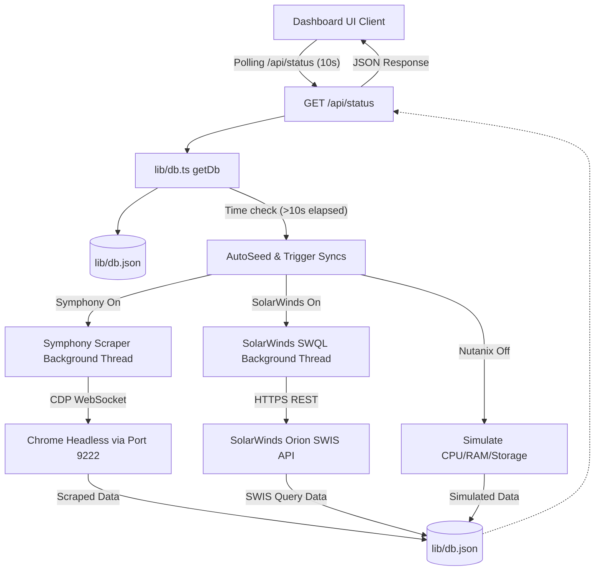

# Developer Documentation: Utkal Alumina NOC Dashboard

This document provides a comprehensive technical guide to the codebase of the **Utkal Alumina NOC Dashboard** (`it-dash`). It covers the project architecture, file structure, database state machine, integration mechanisms, API endpoints, styling conventions, and deployment/run instructions.

---

## 1. Technology Stack

The project is built on a modern full-stack JavaScript environment using **Next.js**:

*   **Core Framework**: Next.js v16.2.6 (using React Server Components and App Router).
*   **Library Core**: React v19.2.4 & TypeScript.
*   **Data Visualization**: Recharts v3.8.1 (for network bandwidth and CPU trend graphs).
*   **Iconography**: Lucide React v1.16.0.
*   **Utilities**:
    *   `ws` v8.20.1 (WebSockets client used for Chrome DevTools Protocol browser scraping).
    *   `xlsx` v0.18.5 (Pure-JS Excel sheet parser for consumable inventory uploads).

---

## 2. Directory Structure

The workspace follows the standard Next.js App Router structure:

```text
it-dash/
├── docs/                             # Project documentation
│   ├── developer_documentation.md    # Codebase & architecture guide (this file)
│   ├── user_manual.md                # End-user & administrator guide
│   └── solarwinds-integration.md     # SolarWinds detailed integration specs
├── public/                           # Static assets
└── src/
    ├── app/                          # App Router pages and API routes
    │   ├── api/
    │   │   └── status/
    │   │       ├── route.ts          # Core database GET/POST config router
    │   │       └── stock/
    │   │           └── route.ts      # Excel inventory stock update API
    │   ├── favicon.ico
    │   ├── globals.css               # Premium design system styles & tokens
    │   ├── layout.tsx                # Font loading and HTML shell configuration
    │   └── page.tsx                  # Main widescreen NOC dashboard viewport
    ├── components/                   # Shared UI Components
    │   ├── ConfigModal.tsx           # Multi-system configuration dialog & Excel uploader
    │   ├── NetworkCard.tsx           # Live gateway metrics and provider analytics
    │   └── UptimeChart.tsx           # Recharts area graph for Rx/Tx bandwidth trends
    └── lib/                          # Data layer & third-party connectors
        ├── db.json                   # Mock database file (active state store)
        ├── db.ts                     # Database reader, writer, and worker engine
        └── solarwinds.ts             # SolarWinds Information Service (SWIS) client
```

---

## 3. Architecture Overview

The application utilizes a **hybrid-mock architecture** where a local JSON database file (`src/lib/db.json`) behaves as a centralized state store. 

When a user accesses the dashboard, the page continuously polls `/api/status` every 10 seconds. The backend state manager (`src/lib/db.ts`) intercepts this request:
1. It reads the current values in `db.json`.
2. If any integration source is marked **Disconnected**, it runs a mathematical **Auto-Seeder** to simulate realistic oscillations in server load, latency, and network utilization.
3. If an integration source is marked **Connected**, it bypasses mock updates for that system and runs asynchronous background workers to pull live telemetry.

### System Workflow


---

## 4. State Management & Database Engine (`src/lib/db.ts`)

The database layer serves as the unified schema provider. The database schema (`DbSchema`) defines the structure:

| Node Field | Type | Description |
| :--- | :--- | :--- |
| `lastUpdated` | `number` | Epoch timestamp of last state transition |
| `servers` | `ServerData[]` | Array of virtual machines and servers |
| `networks` | `NetworkData[]` | Array of active network gateway interfaces |
| `configs` | `{ nutanix, symphony, solarwinds }` | Connective configuration details (endpoint, username, credentials, state) |
| `nutanix` | `NutanixMetrics` | HCI hypervisor aggregate telemetry |
| `symphony` | `SymphonyMetrics` | Ticket counts and SLAs fetched from Hindalco ITSM |
| `cartridges` | `CartridgeItem[]` | Consumable inventory levels mapped from Excel |
| `onboardingRequests` | `OnboardingRequest[]` | 7-day window for HR requests |

### The Seeding Engine (`autoSeed`)
When no live data feeds are active, the `autoSeed` function prevents static mock representations:
*   **Servers**: Modifies CPU and RAM metrics with a slight variance (`-5` to `+5` CPU, `-3` to `+3` Memory) within boundaries (5%–99%). There is a 2% chance a node changes status between `operational` and `degraded`, and a 5% chance backup tasks report `failed`.
*   **Networks**: Fluctuation of traffic utilization and latency.
*   **Nutanix Storage**: Fluctates storage usage between 45% and 85% to ensure active visualization.

> [!NOTE]
> Database queries execute locally on the host server. The JSON storage file (`db.json`) is read and written in a blocking synchronous manner using standard Node.js `fs` operations (`readFileSync`, `writeFileSync`) to avoid concurrency issues during rapid requests.

---

## 5. Integration Implementations

### 5.1 Nutanix CLI Hypervisor Access
The hypervisor telemetry displays overall CPU, memory, and storage utilization across three cluster nodes (`N1`, `N2`, `N3`).
*   **Active Mode**: Accessible via SSH configurations.
*   **Simulated Mode**: Simulated parameters run in `db.ts` when Nutanix connection settings in the config modal have `connected: false`.

### 5.2 Symphony Summit ITSM Scraper
Since Symphony Summit does not offer standard REST endpoints without premium licenses in some environments, the dashboard incorporates a **CDP Scraper** inside the backend:
1. **CDP Port Connection**: The server reaches out to standard Google Chrome debugging endpoint `http://localhost:9222/json`.
2. **Active Session Detection**: It looks for an open tab matching `hsd.adityabirla.com` or containing `Hindalco` in the title.
3. **Tab Auto-Opening**: If the tab is missing, it sends a PUT request to the Chrome debugging port to open a new tab pointed at the analyst dashboard.
4. **WebSocket Evaluation**: The scraper connects directly to Chrome via WebSocket (`webSocketDebuggerUrl`), triggering a `Runtime.evaluate` expression to scrape values directly from the web DOM.
5. **Data Extraction**:
    *   Extracts counts for *My Workgroup* tickets (Incidents, Service Requests, Work Orders, Changes).
    *   Parses SVG elements (`myWorkgroupIncidents`, etc.) by inspecting the relative `x` attribute coordinate of labels (`New`, `Assigned`, `In-Progress`, `Pending`) and matches closest SVG texts.
    *   Parses the Active Incident list from HTML table rows or calls `/MDLIncidentMgmt/IM_WorkgroupTickets.aspx?dashboard=true` using page-relative AJAX calls.
6. **Persistence**: Saved immediately into the local database file.

### 5.3 SolarWinds Orion SWIS Client (`src/lib/solarwinds.ts`)
SolarWinds integration query logic is abstracted into helper functions utilizing the **SolarWinds Information Service (SWIS) REST API**:
*   **Protocol**: HTTPS request mapping to `POST https://{host}:{port}/SolarWinds/InformationService/v3/Json/Query`.
*   **Security**: Uses standard HTTP Basic Auth, wrapping credentials in a Base64 authorization header.
*   **Self-Signed Certs**: Bypasses certificate checks in local intranets using custom HTTPS agent settings (`rejectUnauthorized: false`).
*   **SWQL Queries**:
    ```sql
    -- Servers Query
    SELECT Caption AS [NodeName], IPAddress, PercentCPU AS [CPUPercent], PercentMemoryUsed AS [MemoryPercent], StatusDescription AS [Status] 
    FROM Orion.Nodes

    -- Network Interfaces Query
    SELECT N.Caption AS [NodeName], I.Caption AS [InterfaceName], I.StatusDescription AS [InterfaceStatus], I.InBandwidth AS [InSpeed], I.OutBandwidth AS [OutSpeed]
    FROM Orion.Nodes AS N
    JOIN Orion.NPM.Interfaces AS I ON N.NodeID = I.NodeID
    WHERE I.Caption LIKE '%ISP%' OR I.Caption LIKE '%WAN%'
    ```

### 5.4 Consumables Excel Upload (`src/components/ConfigModal.tsx`)
Excel sheets are parsed directly inside the client browser:
1. The user drops or loads a file into the upload zone.
2. The file is read via `FileReader` using binary string format.
3. `xlsx` parses the file: `XLSX.read(bstr, { type: 'binary' })`.
4. Extracted rows are mapped by checking case-insensitive column headers:
    *   *Type / Model / Code* $\rightarrow$ `type`
    *   *Current / Stock / Qty* $\rightarrow$ `current`
    *   *Target / Capacity / Limit / Threshold* $\rightarrow$ `target`
    *   *Label / Name / Description* $\rightarrow$ `label`
5. The processed array is POSTed to `/api/status/stock`.

---

## 6. API Endpoints Reference

### 6.1 Get Active State
*   **Route**: `GET /api/status`
*   **Headers**: None
*   **Response**: `200 OK`
    ```json
    {
      "lastUpdated": 1716147600000,
      "servers": [...],
      "networks": [...],
      "configs": {
        "nutanix": { "connected": false, "endpoint": "", "username": "", "authMethod": "SSH Key" },
        "symphony": { "connected": false, "endpoint": "", "username": "", "authMethod": "SAML SSO (Chrome Session)" },
        "solarwinds": { "connected": false, "endpoint": "", "username": "", "authMethod": "Basic Authentication" }
      },
      "nutanix": { ... },
      "symphony": { ... }
    }
    ```

### 6.2 Save Integration Configuration
*   **Route**: `POST /api/status`
*   **Content-Type**: `application/json`
*   **Body Fields**:
    ```json
    {
      "system": "symphony",
      "endpoint": "https://hsd.adityabirla.com/MDLIncidentMgmt/SDE_Dashboard.aspx",
      "username": "symphony_agent",
      "authMethod": "SAML SSO (Chrome Session)",
      "secret": "your-session-secret-or-key",
      "connected": true
    }
    ```
*   **Response**: `200 OK` on success, `400 Bad Request` if system is invalid, `500 Internal Server Error` on error.

### 6.3 Update Consumable Stock levels
*   **Route**: `POST /api/status/stock`
*   **Content-Type**: `application/json`
*   **Body Fields**:
    ```json
    {
      "cartridges": [
        { "type": "88A", "current": 42, "target": 100, "label": "HP LaserJet 88A" }
      ]
    }
    ```
*   **Response**: `200 OK` on success.

---

## 7. UI Components & Style Architecture

The design follows a widescreen dashboard layout optimizing vertical scroll real estate.

### Theme Variables (`src/app/globals.css`)
The project utilizes a custom-tailored, warm organic palette representing premium industrial control centers:

```css
:root {
  --background: #f6f3ee;       /* Warm premium ivory-cream */
  --foreground: #3c2f2f;       /* Deep chocolate charcoal for maximum legibility */
  --card-bg: rgba(255, 255, 255, 0.98);
  --card-border: rgba(141, 110, 99, 0.16); /* Clay accent lines */
  --primary: #8d6e63;          /* Terracotta bronze-clay */
  --secondary: #795548;        /* Dark espresso secondary highlights */
  --success: #4e342e;          /* Deep operational brown */
  --warning: #d84315;          /* Terracotta warning */
  --danger: #b91c1c;           /* Alert crimson */
}
```

### Components Layout
*   **`NetworkCard.tsx`**: Features dual custom Recharts area gradients (teal for RJIO, blue for RailTel, red for degraded/down). Calculates deterministic Rx/Tx traffic splits from historical values to plot network trends without storage overhead.
*   **`ConfigModal.tsx`**: Controls connection flows. Handles asynchronous validation handshakes, displaying loaders and clean success/failure badges.
*   **`page.tsx`**: Sets up widescreen margins and positions components inside responsive layouts. Includes interactive SVG animations for status indicators (`pulse`) and the bottom console clock (driven by calculated rotational degree geometry values `hrAngle`, `minAngle`, `secAngle`).

---

## 8. Build, Linting, and Scripts

### Available Commands
Use the standard npm CLI commands:

```bash
# Start Next.js development server
npm run dev

# Lint codebase using ESLint
npm run lint

# Compile production package bundle
npm run build

# Start production server
npm run start
```

### Production Build Validation
Ensure typescript and lint rules are satisfied prior to repository commits. The build pipeline runs strict TypeScript checking (`tsc`) alongside Next.js optimization compilation. Running `npm run build` will export assets and precompile routes to the `.next` workspace directory.
